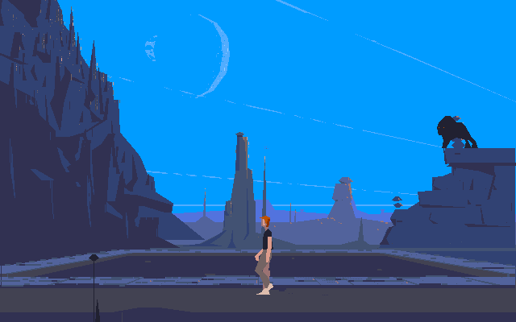

# Another World JS

This is a Javascript (HTML5) port of the game <a href="https://www.mobygames.com/game/out-of-this-world">Another World</a> designed by <a href="http://www.anotherworld.fr/">Eric Chahi</a>.




# Internals

The Javascript code interprets the original game bytecode.


# Data files

As the game data files are not freely distributable (at the exception of the demo versions), you will need to extract and convert them.
This can be done using [extract.py](https://github.com/cyxx/another_js/blob/master/extract.py).

The script takes a .zip file as input and outputs a .js file to be included in the .html file.

For example, the DOS demo data files can be converted with these commands :

```
$ zipinfo ootwdemo.zip
Archive:  ootwdemo.zip
Zip file size: 531072 bytes, number of entries: 14
-rw-a--     1.1 fat        4 b- stor 91-Sep-20 14:52 VOL.1
-rw-a--     1.1 fat        4 b- stor 91-Sep-20 14:52 VOL.END
-rw-a--     1.1 fat     2940 b- i4:2 92-Jan-21 14:46 MEMLIST.BIN
-rw-a--     1.1 fat       16 b- shrk 92-Jan-20 16:10 TABVOL.BIN
-rw-a--     1.1 fat     1024 b- i4:2 92-Jan-19 11:51 DEMO3.JOY
-rw-a--     1.1 fat   201522 b- stor 92-Jan-21 14:46 BANK01
-rw-a--     1.1 fat    77608 b- stor 92-Jan-13 18:28 BANK02
-rw-a--     1.1 fat    15100 b- i4:2 92-Jan-13 18:39 BANK05
-rw-a--     1.1 fat    44034 b- stor 92-Jan-13 18:40 BANK06
-rw-a--     1.1 fat   162364 b- stor 92-Jan-20 13:08 BANK0D
-rw-a--     1.1 fat     1182 t- i4:2 92-Jan-13 18:17 CONFIG.LNG
-rwxa--     1.1 fat     7852 b- stor 92-Jan-13 18:15 CONFIG.EXE
-rw-a--     1.1 fat     2624 t- i4:2 92-Jan-29 00:00 README
-rwxa--     1.1 fat    17947 b- stor 92-Jan-20 16:09 OOTWDEMO.EXE
14 files, 534221 bytes uncompressed, 529759 bytes compressed:  0.8%

$ gcc -shared -o bytekiller_unpack.so unpack.c

$ LD_LIBRARY_PATH=$( pwd ) python extract.py ootwdemo.zip > ootwdemo.js
```


# Status

The DOS demo version of the game can be played at [cyxx.github.io/another_js](http://cyxx.github.io/another_js)

Music and sounds are not played.
